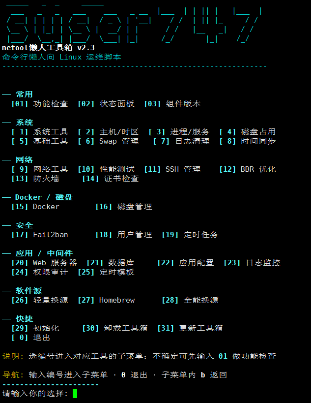
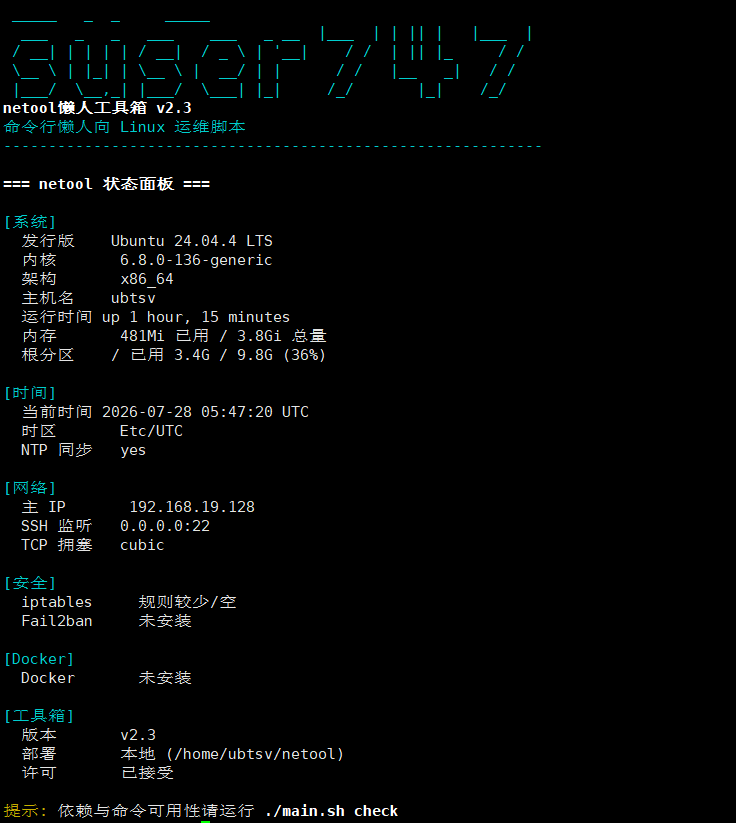

# netool 懒人工具箱

命令行 Linux 运维脚本集合。**一个入口**：菜单交互或命令行参数，覆盖系统、网络、安全、磁盘、Docker、换源、**应用中间件**等。当前版本 **v2.3**。

## 30 秒上手

复制下面**任意一条**命令到终端即可运行：

```bash
# 方式 A：进入交互菜单（最常用）
bash <(curl -fsSL https://gitee.com/suser747/netool/raw/master/main.sh)

# 方式 B：直接执行某个工具（如检查系统状态）
bash <(curl -fsSL https://gitee.com/suser747/netool/raw/master/main.sh) status
```

> 完整命令格式：`bash <(curl -fsSL https://gitee.com/suser747/netool/raw/master/main.sh) <工具名> [参数]`

---

## 项目截图

> 将截图放入 `docs/images/` 后，取消下方注释即可在文档中显示。

<!-- 交互菜单 -->
<!--  -->
*（预留：menu.png — 运行 `./main.sh` 或远程入口命令的菜单界面）*

<!-- 状态面板 -->
<!--  -->
*（预留：status.png — `./main.sh status` 输出示例）*

<!-- curl 远程 -->
<!--  -->
*（预留：curl-demo.png — 远程一键检查/换源等终端截图）*

---

## 两种使用方式

| | **curl 远程运行** | **本地直接使用** |
|---|-------------------|------------------|
| **是什么** | 只下载 `main.sh`，子脚本按需从 Gitee 拉取 | 整个仓库在服务器上（克隆/FTP/scp） |
| **要不要上传** | 否 | 是 |
| **要不要联网** | 是（访问 gitee.com） | 脚本可离线；装软件/换源仍可能要网 |
| **适合** | 临时运维、新机器快速检查 | 生产、内网、频繁使用 |
| **更新** | 每次自动最新 | `git pull` 或重新上传 |

---

## 一、curl 远程运行

**原理：** 服务器只需 `curl` + `bash`，无需上传整个项目。`main.sh` 会自动从 Gitee 下载 `common.sh` 和所需子脚本，执行前做 `bash -n` 语法校验防篡改。

**要求：** Linux · Bash 3.2+ · 能访问 Gitee · 改配置需 `sudo`

### 1.1 进入交互菜单

```bash
# ✅ 推荐：进程替换，菜单可正常输入
bash <(curl -fsSL https://gitee.com/suser747/netool/raw/master/main.sh)

# ⚠️ 管道模式：菜单无法输入（stdin 被占用），仅适合带参数的非交互调用
curl -fsSL https://gitee.com/suser747/netool/raw/master/main.sh | bash
```

> **为什么推荐 `bash <(...)`？** 进程替换把 curl 输出重定向到一个临时文件描述符，bash 的 stdin 仍连接终端，菜单可以正常读取键盘输入。而 `curl | bash` 中 bash 的 stdin 被管道占用，`read` 会读到脚本内容而非键盘，菜单无法交互。

### 1.2 直接执行工具（推荐日常）

把工具名和参数跟在后面即可，复制即用：

```bash
bash <(curl -fsSL https://gitee.com/suser747/netool/raw/master/main.sh) check          # 功能检查
bash <(curl -fsSL https://gitee.com/suser747/netool/raw/master/main.sh) status         # 状态面板
bash <(curl -fsSL https://gitee.com/suser747/netool/raw/master/main.sh) versions       # 组件版本
bash <(curl -fsSL https://gitee.com/suser747/netool/raw/master/main.sh) system info    # 系统信息
bash <(curl -fsSL https://gitee.com/suser747/netool/raw/master/main.sh) mirror --plan  # 换源预览（不改系统）
bash <(curl -fsSL https://gitee.com/suser747/netool/raw/master/main.sh) init           # 初始化向导
bash <(curl -fsSL https://gitee.com/suser747/netool/raw/master/main.sh) -q check       # 静默，仅错误
```

### 1.3 设置短别名（可选）

每次输入完整 URL 太长，可设别名：

```bash
# 写入 ~/.bashrc 后 source 生效
echo "alias netool='bash <(curl -fsSL https://gitee.com/suser747/netool/raw/master/main.sh)'" >> ~/.bashrc
source ~/.bashrc

# 之后直接用
netool              # 进菜单
netool status       # 查状态
netool mirror --plan
```

### 1.4 内置 vs 需下载

| 类型 | 命令 | 是否下载子脚本 |
|------|------|----------------|
| 内置 | `check` `status` `versions` `update` `uninstall` | 否 |
| 子工具 | `mirror` `disk` `ssh` `system` … | 是 |

### 1.5 curl 常见问题

| 问题 | 原因与处理 |
|------|-----------|
| 菜单不能输入 | 用了 `\| bash` 管道模式，改用 `bash <(curl ...)` 进程替换 |
| 下载失败 / 404 | 勿用 `raw/m/i`（不存在）；请用 **`raw/master/main.sh`**；确认能访问 gitee.com |
| 中文乱码 | `export LANG=zh_CN.UTF-8 LC_ALL=zh_CN.UTF-8` 后重试 |
| 权限不足 | 改系统配置的命令加 `sudo`：`sudo bash <(curl ...) mirror -y` |

---

## 二、本地直接使用

**说明：** 把完整项目放到服务器（如 `/opt/netool`），`main.sh` 检测到本地 `tools/` 目录后**直接执行磁盘上的子脚本**，不经过 curl 下载，速度更快，适合离线/内网。

### 2.1 获取项目

```bash
# Git（推荐）
git clone https://gitee.com/suser747/netool.git /opt/netool
cd /opt/netool
chmod +x main.sh && find tools -name "*.sh" -exec chmod +x {} \;

# 或 scp 上传后同样赋权
```

### 2.2 运行

```bash
cd /opt/netool

./main.sh                    # 菜单
./main.sh check
./main.sh status
./main.sh system info
./main.sh mirror --plan
./main.sh init
./main.sh --version
./main.sh versions
./main.sh --list
```

### 2.3 全局命令

```bash
ln -sf /opt/netool/main.sh /usr/local/bin/netool
netool status
```

### 2.4 更新

```bash
cd /opt/netool && git pull --ff-only origin master
```

### 2.5 curl 与本地命令对照

curl 远程运行的命令只需把 `bash <(curl -fsSL https://gitee.com/suser747/netool/raw/master/main.sh)` 替换成本地的 `./main.sh`，其余参数完全一样：

| 功能 | curl 远程 | 本地 |
|------|-----------|------|
| 进菜单 | `bash <(curl -fsSL …/master/main.sh)` | `./main.sh` |
| 功能检查 | `bash <(curl -fsSL …/master/main.sh) check` | `./main.sh check` |
| 状态面板 | `bash <(curl -fsSL …/master/main.sh) status` | `./main.sh status` |
| 换源预览 | `bash <(curl -fsSL …/master/main.sh) mirror --plan` | `./main.sh mirror --plan` |
| 初始化 | `bash <(curl -fsSL …/master/main.sh) init` | `./main.sh init` |

> 上表 `…/master/main.sh` = `https://gitee.com/suser747/netool/raw/master/main.sh`

改系统配置类命令请加 `sudo`：`sudo ./main.sh mirror -y`

---

## 三、常用命令

| 命令 | 说明 |
|------|------|
| `check` | 依赖与功能检查 |
| `status` | 系统/网络/安全/Docker 摘要 |
| `versions` | 主版本 + 组件版本 |
| `system info` | 系统信息 |
| `mirror --plan` | 轻量换源预览 |
| `lmirrors` | 全能换源（更多发行版） |
| `bbr status` / `bbr enable -y` | BBR |
| `ssh` | SSH 端口管理 |
| `docker status` / `docker install --plan` | Docker |
| `disk status` / `disk-test --plan` | 磁盘 / 验盘预览 |
| `init` | 新服务器向导 |
| `web` / `db` / `audit` | Web / 数据库 / 权限审计 |
| `app-config scan` | 应用配置扫描 |
| `logs usage` | 日志与监控查看 |
| `cron-templates list` | 定时任务模板 |
| `uninstall` | 删除工具箱配置与日志 |

完整列表：`./main.sh --list` 或 `./main.sh --help`

### 菜单编号速查

主菜单选**大类**，进入子菜单后再选具体操作。

| 分区 | 编号 | 功能 |
|------|------|------|
| **常用** | 01–03 | 功能检查 / 状态面板 / 组件版本 |
| **系统** | 1–8 | 系统、主机、进程、磁盘占用、基础工具、Swap、日志清理、NTP |
| **网络** | 9–14 | 网络、性能、SSH、BBR、防火墙、证书 |
| **容器/存储** | 15–16 | Docker、磁盘 |
| **安全** | 17–19 | Fail2ban、用户管理、定时任务 |
| **应用/中间件** | 20–25 | Web、数据库、应用配置、日志监控、权限审计、定时模板 |
| **软件源** | 26–28 | 轻量换源、Homebrew、全能换源 |
| **快捷** | 29–31 | 初始化、卸载、更新工具箱 |
| | 0 | 退出 |

> **导航：** 主菜单 `0` 退出 · 子菜单 `b` 返回  
> **CLI 示例：** `./main.sh web check nginx` · `./main.sh db status` · `./main.sh audit all`

应用模块说明见 [docs/ROADMAP.md](./docs/ROADMAP.md)。

---

## 四、环境与安全

```bash
export NETOOL_SKIP_LICENSE=1      # 跳过首次许可提示（自动化）
export NETOOL_SKIP_LOCALE_TIP=1   # 跳过 locale 提示
```

- 改配置前可用 `--plan` / `--dry-run` 预览  
- 验盘需确认短语 `DESTROY-DISK-TEST`；擦盘需 `WIPE-CONFIRM`  
- 配置备份：`/var/backups/netool-*` · 审计：`/var/log/netool/`

### 用户许可（摘要）

使用即表示理解：部分功能会修改系统；验盘/擦盘会 destroy 数据；工具按现状提供，误操作风险自负。完整条款见运行时的许可提示。不同意请勿使用。

---

## 五、开发与贡献

```bash
bash scripts/validate.sh   # 语法 + 冒烟测试
```

- 新工具放 `tools/<分类>/`，引入 `load_common.sh`，在 `main.sh` 注册路由  
- 更新 `tools/versions.env` 与 `CHANGELOG.md`  
- Bash 3.2 兼容（禁用 `${var,,}`）· 推荐 shellcheck  

---

## 六、其他

| 路径 | 说明 |
|------|------|
| `~/.config/netool/` | 用户配置 |
| `VERSION` / `tools/versions.env` | 版本定义 |
| [CHANGELOG.md](./CHANGELOG.md) | 变更记录 |
| [LICENSE](./LICENSE) | Apache 2.0 |

仓库：https://gitee.com/suser747/netool
